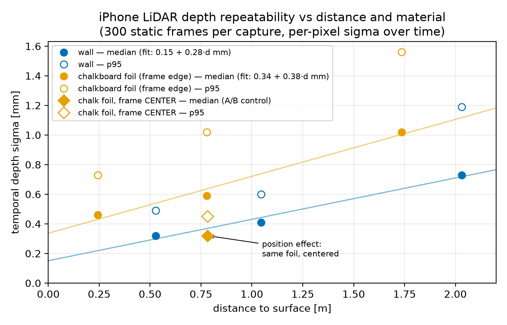

# Depth noise characterization of the iPhone LiDAR stream

## Problem

The depth-sensor noise measured here serves as the basis for choosing the inlier
threshold for wall detection via RANSAC. The sensor used in this project is the
iPhone 15 Pro LiDAR; data is collected with Record3D over USB-C as a 256×192
depth stream at 30 fps. The raw sensor data is processed by ARKit
(fused/upsampled) before it reaches us.

## Method

Data was collected in a room with a south-facing window and a west-facing
balcony window around 10am mid-July. Measurements were taken at three nominal distances (2 m, 1 m,
0.5 m), 300 frames each, with the sensor position fixed during each capture
(per-surface distances measured from the data are reported in the table). The
sensor faced a blank wall head-on; at the right edge of the frame, roughly
0.2 m closer than the wall, stood a chalkboard foil. For each capture, two
rectangular regions were manually placed and visually verified — one containing
only wall pixels, one containing only chalkboard-foil pixels. Per distance and
surface, the median (p50) and 95th percentile (p95) of the per-pixel standard
deviation across the 300 temporal frames were computed. The p95 is the core
quantity for the RANSAC threshold, since the threshold must accommodate the
worst ordinary pixels rather than the typical one.

Because the two surfaces occupied distinctly different positions within the
sensor frame in the main captures, one additional control measurement was
performed at 1 m distance to the wall with the chalk foil centered in the
frame.

Zero-valued measurements (the sensor's no-return code) were set to NaN and
excluded from all statistics; their share of pixels per rectangle is listed in
the "invalid [%]" column.

## Results

| surface | distance [m] | σ median [mm] | σ p95 [mm] | invalid [%] |
|---|---|---|---|---|
| wall | 0.53 | 0.32 | 0.49 | 0.0 |
| wall | 1.05 | 0.41 | 0.60 | 0.0 |
| wall | 2.03 | 0.73 | 1.19 | 0.0 |
| chalkboard foil (frame edge) | 0.24 | 0.46 | 0.73 | 0.0 |
| chalkboard foil (frame edge) | 0.78 | 0.59 | 1.02 | 0.0 |
| chalkboard foil (frame edge) | 1.73 | 1.02 | 1.56 | 0.0 |

The noise data is well described by an affine noise model σ(d) = σ₀ + k·d.
Note that this model should be read as a trend rather than a validated law, as
each fit rests on only three data points.

A follow-up single-pixel analysis (histogram and unique-value spacing of one
pixel's 300 samples) revealed that the depth stream is **float16-quantized**:
distinct depth values are spaced exactly 0.48828125 mm (2⁻¹¹ m) below 1 m and
exactly 0.9765625 mm (2⁻¹⁰ m) above 1 m — the power-of-two step doubling that
fingerprints a 10-bit-mantissa float encoding (a sensible bandwidth trade for
USB streaming). Consequently, at quiet central pixels the measurements are
quantization-limited rather than noise-limited (discrete histograms; the
68–95–99.7 Gaussian fractions only appear where σ spans several grid steps).
The affine trend therefore conflates ranging noise with float16 quantization,
whose step doubles at each power of two; both contribute to the effective σ
the detector must tolerate, so the model remains the right input for
threshold design.

While the main measurements suggest that the chalkboard foil produces noisier
depth data (median fit: 0.34 + 0.38·d mm) than the wall (median fit:
0.15 + 0.28·d mm), the additional control experiment with the centered chalk
foil refutes that hypothesis: at 1 m distance to the wall (0.8 m to the foil),
the foil's noise drops to the level of the wall measurements — even slightly
below. The measured differences in the table therefore reflect a
frame-position effect rather than a material effect.

## Failure modes & surprises

- A sanity check (visual inspection and manual spot samples) caught
  physics-violating numbers caused by an axes mix-up: the first analysis pooled
  the standard deviation spatially across pixels instead of computing per-pixel
  temporal sigma. Only per-pixel measurements over time — scene held constant —
  isolate the sensor's measurement variance (precision); pooling mixes in the
  scene's real depth variation. The standard deviation must be computed per
  pixel across the temporal axis (axis 0).
- Named rectangle overlays were added to the mean-depth image for visual
  verification before any statistics are computed. The rectangles must be
  defined on the mean-depth visualization, which represents the scene — not on
  the sigma map, which represents the very quantity being measured.
- Environmental and setup factors influence the noise and must be recorded or
  controlled: light sources and intensity (direct/indirect sunlight, indoor
  lighting), surface material, the object's position within the frame, and the
  distance d.
- Zero invalid returns occurred across all captures, but invalid returns must
  in general be detected and set to NaN so that they are excluded from the
  analysis.
- This analysis measures the repeatability of the measurements (sensor
  precision). It does not assess whether the captured data represents the
  scene correctly (accuracy).

## Consequences for the detector

The working distance in this project will be roughly 0.5–1 m to the chalk
board. In this range there are two options for accounting for sensor noise:

- Simple approach: one conservative threshold sized to the edge-position noise
  (≥ p95) applied everywhere.
- Refined approach: a spatially varying threshold, where pixels near the frame
  center receive a smaller noise allowance than peripheral pixels near the
  edges.

## Next

- RANSAC implementation for chalk-wall detection.
- Choose the RANSAC threshold large enough to cover the measured p95.
- Sunlight A/B measurements.
